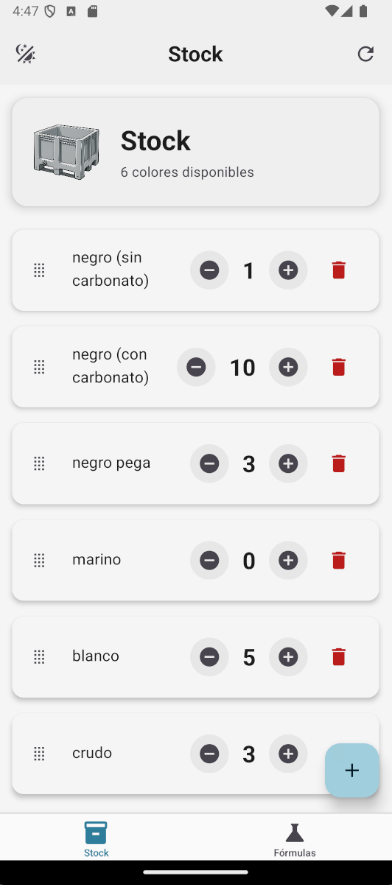

# Aplicación de Gestión de Fórmulas de Goma

Una aplicación móvil desarrollada con React Native y Expo para la gestión de inventario de colores de goma y fórmulas.


## Descripción

Esta aplicación permite gestionar el inventario de colores de goma y sus fórmulas asociadas. Está diseñada para facilitar el seguimiento de stock, la creación de nuevas fórmulas y la gestión eficiente de los recursos.

## Características Principales

- **Gestión de Stock**:
  - Visualización del inventario de colores
  - Añadir y eliminar colores
  - Reordenar colores mediante arrastrar y soltar
  - El inventario se sincroniza en tiempo real con la API

- **Gestión de Fórmulas**:
  - Visualización de fórmulas existentes
  - Creación de nuevas fórmulas
  - Asociación de colores a fórmulas
  - Edición y eliminación de fórmulas

- **Interfaz de Usuario**:
  - Diseño moderno con **Material Design 3** usando `react-native-paper`
  - Cambio de tema: claro, oscuro y automático, con persistencia vía `AsyncStorage`
  - Notificaciones toast personalizadas (`react-native-toast-message`)
  - Splash screen nativo configurado con `expo-splash-screen`
  - Tabs y elementos activos/inactivos con colores MD3 consistentes
  - Cabeceras y botones con diseño mejorado y animaciones sutiles
  - Mensajes y notificaciones en español

## Tecnologías Utilizadas

- **Frontend**:
  - React Native, Expo y Expo Router
  - React Navigation, Gesture Handler, Reanimated
  - React Native Draggable FlatList
  - React Native Toast Message
  - React Native Paper (Material Design 3)
  - Expo Splash Screen, Expo Build Properties

- **Datos y Persistencia**:
  - API REST para stock: `https://api-rubber-hono.onrender.com/stock`
  - API REST para fórmulas: `https://api-rubber-hono.onrender.com/formulas`
  - `AsyncStorage` para: preferencia de tema y orden de colores

## Requisitos del Sistema

### Mínimos
- **Node.js**: 18.x o superior
- **npm**: 8.x o superior (o yarn/pnpm)
- **React Native**: 0.76.x
- **Expo CLI**: 52.x o superior
- **Dispositivo móvil**:
  - Android: API level 24 (Android 7.0) o superior
  - iOS: 13.0 o superior (para desarrollo con Expo Go)
- **Memoria RAM**: 4GB mínimo recomendado
- **Espacio en disco**: 2GB libre

### Para desarrollo
- **Sistema operativo**: Windows 10+, macOS 10.15+, Linux
- **Expo Go**: Para probar en dispositivos físicos
- **Emulador**: Android Studio (para Android) o Xcode (para iOS)

```
goma-gestion-react-native/
├── api/                        # Conexión con la API
│   ├── stockApi.ts             # Endpoints de stock
│   └── formulasApi.ts          # Endpoints de fórmulas
├── app/                        # Rutas y pantallas (Expo Router)
│   ├── (tabs)/                 # Navegación por pestañas
│   │   ├── _layout.tsx         # Layout de tabs + Appbar
│   │   ├── index.tsx           # Pantalla Stock
│   │   └── formulas.tsx        # Listado de fórmulas
│   ├── formulas/
│   │   ├── [id].tsx            # Detalle de fórmula (MD3, Appbar propio)
│   │   ├── nueva-formula.tsx   # Crear/editar fórmula (MD3)
│   │   └── nueva-formula-backup.tsx
│   ├── _layout.tsx             # Layout raíz (PaperProvider, Toast, Stack)
│   └── +not-found.tsx          # Rutas no encontradas
├── assets/
│   ├── fonts/
│   └── images/                 # chemical.png, palot.png, splash-init.png, íconos
├── components/                 # UI reutilizable
├── constants/                  # Colores y spacing
├── contexts/
│   └── ThemeContext.tsx        # Sistema de temas (claro/oscuro/auto)
├── theme/
│   └── md3-theme.ts            # Temas MD3 personalizados
├── types/                      # Tipos TS (colors, formulas)
├── utils/
│   └── toast.ts                # Utilidad de toasts
└── eas.json                    # Perfiles de build (APK con profile preview)
```

## Uso

### Gestión de Stock

1. En la pantalla principal, visualiza todos los colores disponibles.
2. Utiliza el botón "+" para añadir un nuevo color.
3. Desliza un color hacia la izquierda para eliminarlo.
4. Mantén presionado y arrastra para reordenar los colores.
5. Utiliza el botón de recarga para actualizar el inventario desde la API.

### Gestión de Fórmulas

1. En la sección de "Fórmulas", visualiza todas las fórmulas disponibles.
2. Selecciona una fórmula para ver sus detalles.
3. Crea, edita o elimina fórmulas según sea necesario.

## Notificaciones Personalizadas

Se implementó un sistema de notificaciones toast personalizado usando `react-native-toast-message`, con mensajes en español y un diseño visual mejorado (títulos grandes, mensajes legibles).

## Cambios Visuales

- Migración a **Material Design 3** en pantallas clave (`app/formulas/[id].tsx` y `app/formulas/nueva-formula.tsx`) con `react-native-paper`.
- Alternancia de tema claro/oscuro/auto desde los headers de Stock y Fórmulas (persistente con `AsyncStorage`).
  - Tabs activos/inactivos con colores MD3 adecuados para mejor visibilidad.
  - Splash screen usando `assets/images/splash-init.png` con `resizeMode: contain` y fondo blanco.
  - En rutas `formulas/[id]` y `formulas/nueva-formula` se oculta el header del Stack porque renderizan su propio `Appbar`.

## Animaciones Implementadas

- **Animaciones de entrada suaves** en la pantalla de Stock usando `react-native-reanimated`:
  - Header aparece desde arriba con `withSpring`
  - Contenido sube desde abajo con delay y `withSpring`
  - FAB (botón flotante) aparece con escala usando `withSpring`
- **Animaciones sincronizadas** con la splash screen para una experiencia fluida
- **Sin parpadeo en TextInput** - Solución implementada para eliminar el molesto flickering en los inputs de texto

## Capturas de pantalla
<div style="display: flex; flex-wrap: wrap; gap: 8px;">
  
  
  
  
</div>

## Instalación y Ejecución

1. Clona el repositorio:
   ```
   git clone https://github.com/tu-usuario/goma-gestion-react-native.git
   ```
2. Instala las dependencias:
   ```
   npm install
   # o
   yarn install
   ```
3. Inicia el proyecto con Expo:
   ```
   npx expo start
   ```
4. Escanea el código QR con la app Expo Go en tu dispositivo móvil o ejecuta en un emulador.

### Generar APK (Android)

La app está preparada para build con EAS. Versión actual: `2.2.1` (Android `versionCode: 5`).

1. Inicia sesión en Expo (si aplica):
   ```bash
   npx expo login
   ```
2. Genera la APK con el perfil `preview` definido en `eas.json`:
   ```bash
   npx eas build --platform android --profile preview
   ```
3. Sigue el enlace que provee EAS para descargar la APK una vez finalizado el build.
4. Si necesitas un AAB o build de producción, puedes usar:
   ```bash
   npx eas build --platform android --profile production
   ```
5. La versión actual de la app es `2.2.1` con `versionCode: 5` para Android.

## Scripts Disponibles

El proyecto incluye varios scripts útiles en `package.json`:

### Scripts de desarrollo
- `npm start` o `npx expo start` - Inicia el servidor de desarrollo
- `npm run android` - Inicia la app en Android
- `npm run ios` - Inicia la app en iOS
- `npm run web` - Inicia la app en web browser

### Scripts de utilidad
- `npm run reset-project` - Reinicia el proyecto (elimina archivos innecesarios)
- `npm test` - Ejecuta las pruebas con Jest
- `npm run lint` - Ejecuta el linter de código

### Scripts específicos
- `npm run android:auto` - Inicia Android con respuesta automática "Y" para confirmaciones

## Troubleshooting

### Problemas comunes y soluciones

#### 1. Error: "Metro bundler process exited"
- **Solución**: Limpia la caché de Metro
  ```bash
  npx expo start --clear
  ```

#### 2. Las animaciones no se ven en el emulador de Android
- **Problema**: Los emuladores de Android tienen las animaciones deshabilitadas por defecto
- **Solución**: 
  1. Abre AVD Manager en Android Studio
  2. Edita el dispositivo virtual
  3. Ve a "Show Advanced Settings"
  4. Desmarca "Disable animations"

#### 3. Error de conexión a la API
- **Verifica**: Que la API esté funcionando en `https://api-rubber-hono.onrender.com`
- **Solución**: Comprueba tu conexión a internet
- **Alternativa**: Usa datos móviles en lugar de WiFi

#### 4. Problemas con TextInput (parpadeo)
- **Solución**: Ya implementado - usa `defaultValue` en lugar de `value` en todos los TextInput
- **Si persiste**: Reinicia la app o limpia la caché

#### 5. Error: "Cannot resolve module"
- **Solución**: Reinstala las dependencias
  ```bash
  rm -rf node_modules package-lock.json
  npm install
  ```

#### 6. Problemas con Expo Go
- **Solución**: Actualiza Expo Go a la última versión
- **Alternativa**: Usa un emulador en su lugar

#### 7. Error de build con EAS
- **Verifica**: Que tienes `eas.json` configurado correctamente
- **Solución**: Revisa los logs del build en el dashboard de EAS

### Reportar bugs
Si encuentras un problema no listado aquí, por favor reporta un issue en el repositorio con:
- Descripción detallada del problema
- Pasos para reproducirlo
- Capturas de pantalla (si aplica)
- Información del dispositivo y versión de la app

## Contribución

¡Las contribuciones son bienvenidas! Por favor sigue estos pasos:

### Pasos para contribuir

1. **Fork** el repositorio
2. **Crea** una rama para tu feature:
   ```bash
   git checkout -b feature/nueva-funcionalidad
   ```
3. **Haz tus cambios** siguiendo las convenciones del proyecto
4. **Prueba** que todo funciona correctamente
5. **Commit** tus cambios:
   ```bash
   git commit -m "feat: agregar nueva funcionalidad"
   ```
6. **Push** a tu rama:
   ```bash
   git push origin feature/nueva-funcionalidad
   ```
7. **Crea** un Pull Request

### Convenciones de código

- Usa **TypeScript** para todos los archivos nuevos
- Sigue las **guías de ESLint** configuradas
- Usa **Material Design 3** para componentes de UI
- Escribe **mensajes de commit** en español siguiendo conventional commits
- Documenta **funciones y componentes** con JSDoc

### Estructura de commits

Usamos conventional commits:
- `feat:` para nuevas funcionalidades
- `fix:` para correcciones de bugs
- `docs:` para cambios en documentación
- `style:` para cambios de formato
- `refactor:` para refactorización de código
- `test:` para agregar tests

### Testing

Antes de enviar un PR, asegúrate de:
- ✅ Las animaciones funcionan correctamente
- ✅ No hay errores de linting
- ✅ La app compila sin errores
- ✅ Las funcionalidades nuevas están probadas
- ✅ No se rompen funcionalidades existentes

## Créditos

Desarrollado por efe13dev@gmail.com.

API creada por mí en render.com usando Hono.

## Licencia

MIT
